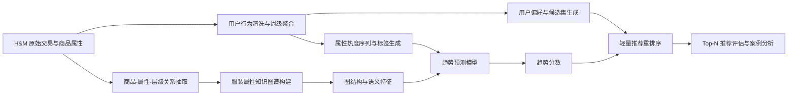

# 基于项目现状的毕业论文编排与文献研究报告

## 执行摘要

你已经提供了 `project-status-summary.md`，而且从该文件可见，当前项目并不是“刚开始构思”的状态，而是已经完成了从 H&M 原始交易数据、商品属性解析、周级属性热度构造、LightGBM 趋势预测，到趋势感知轻量推荐验证的一条可复现主流程；数据规模、时间切分、特征工程、趋势评估指标、推荐实验脚本与产物目录都已明确，因此现在最合适的策略不是继续大幅扩模型，而是**冻结问题定义、固化实验口径、转入论文叙事与结果整理**。文件还明确建议“优先论文撰写、图表整理、答辩材料准备，而不是继续扩展模型范围”。

结合你的题目《融合用户行为与知识图谱的服装流行趋势预测与推荐》，最稳妥、最符合当前成果边界的论文主线应当表述为：**以用户购买行为构造服装属性级时序热度信号，以商品—属性—层级关系构建属性知识图谱，在此基础上完成周级流行趋势预测，并将趋势分数注入轻量推荐重排序以验证实用价值**。这样写，既能保住题目中的“用户行为”“知识图谱”“趋势预测”“推荐”四个关键词，又不会把论文硬推成一个尚未完成的大型端到端联合深度推荐系统。

从项目文件可见，你当前已经拥有一组足以支撑毕业论文主体的结果：H&M 全量原始交易约 3180 万条、商品约 10.55 万、客户约 136 万；构建了 10 类服装属性、592 个属性值、逾百万元素级图边；按周严格时间切分训练/验证/测试；趋势预测主模型为 LightGBM，并在测试集上相对简单启发式基线取得明显优势。基于这些事实，论文应把**趋势预测实验**作为主证据，把**推荐实验**作为“下游验证/应用验证”来写，而不是反过来。

方法层面，建议采用“三层叙事”结构。第一层写**当前已完成且最可靠的主线方案**：周级属性趋势预测 + 轻量趋势感知推荐。第二层写**低风险可补强方案**：加入更明确的用户行为序列特征、时间衰减偏好特征、属性共现迁移特征，而不改变主架构。第三层写**高风险扩展方案**：SASRec/BERT4Rec、KGIN/KGAT、TKG-SRec 等端到端模型，作为相关工作比较与未来工作，不建议为了论文定稿临时大改。序列推荐、KG 推荐与时尚推荐文献都表明，这些模型有效，但实现与调参成本显著更高。

实验设计上，必须坚持**时间一致性**和**无泄漏**。推荐部分不能用随机切分，趋势部分不能把未来周信息灌入当前周特征；推荐评估还要避免“负采样方式改变结论”的常见陷阱，最好补充用户级 bootstrap 置信区间和效应量报告。近年的推荐评估研究对离线评估采样偏差、显著性检验膨胀问题都有明确提醒；预测部分则适合使用周级误差比较与 Diebold–Mariano 类检验。

文献方面，围绕趋势预测、推荐系统、知识图谱、用户行为建模、时尚/服装应用，我为你整理了**超过 30 篇**中英文参考文献，并给出了每篇的简短摘要、为何引用、建议引用位置、DOI/可获取性说明。整体建议的引用策略是：**绪论与相关工作以综述+领域代表作铺垫，方法章以原始模型论文支撑，实验章以评估方法论文约束实验规范，结论章回扣与你工作最接近的时尚场景论文**。

## 项目现状与论文定位

当前项目的最强优势不是“模型足够复杂”，而是**问题闭环已经完整**。项目文件显示，你已经完成了：原始数据清洗与对齐、商品属性抽取、属性知识图谱构建、周级聚合、趋势标签生成、LightGBM 训练与评测、推荐样本生成、趋势分数注入重排序，以及用于复现实验的脚本与目录组织。这意味着你的论文应当优先强调“**研究问题定义合理、数据构造严谨、实验设计完整、结果可复现**”，而不是追求一个看起来更“深”的新模型。

更具体地说，题目中的“用户行为”可以在论文中被严格定义为**用户交易序列、周级购买频次、最近窗口偏好、属性偏好分布与时间衰减行为信号**；“知识图谱”可以定义为**商品—属性值—属性类型—层级关系**构成的服装属性图；“流行趋势预测”则是**面向属性级别的周级热度变化预测**；“推荐”则是**将趋势预测结果用于候选重排序的下游验证**。这样定义之后，你的题目与现有项目产物是对齐的。

如果学院允许你微调题目但不改变核心方向，我更推荐把最终定稿题目改成下面这种更贴合成果边界的版本：

> **融合用户行为与属性知识图谱的服装流行趋势预测与趋势感知推荐研究**

如果题目必须保持不变，那么建议在摘要和绪论里明确写出：**本文的推荐模块以趋势验证为目标，而非面向全场景生产系统的完整个性化推荐引擎**。这是为了让“研究贡献”与“实验边界”一致，避免答辩时被追问“为什么没有实现一个端到端的用户—商品—知识图谱联合深度推荐模型”。

项目文件里最值得你直接提炼进摘要或“本文贡献”部分的内容，可以概括为四点：其一，基于 H&M 零售数据，将服装流行趋势预测细化为属性级周趋势建模；其二，构建覆盖商品与属性层级的服装属性知识图谱；其三，基于时序、统计、图结构与类别特征训练趋势预测模型，并相对简单基线取得更优结果；其四，将趋势结果注入轻量推荐流程，验证趋势信息对 Top-N 推荐有现实辅助价值。

下面这张流程图适合作为论文中的“研究总体框架图”。它避免把系统描述得过于工程化，同时清楚展示“用户行为—知识图谱—趋势预测—推荐验证”的逻辑链条。其叙事方式也与近年的时尚推荐与 KG 推荐综述相一致。

## 论文结构与章节写作指导

前置部分建议包括：**中文摘要、英文摘要、目录、符号说明、图表目录**。后置部分建议包括：**参考文献、附录、致谢**。其中符号说明非常重要，因为你的论文同时涉及时间序列、图结构与推荐排序，如果没有统一符号，后文会显得散。这个组织方式与推荐系统和时尚推荐综述的写法是一致的。

### 推荐章节大纲表

| 章节 | 建议子章节 | 目标 | 写作要点 | 方法/实验安排 | 数据需求与指标 | 预期结果 | 常见陷阱 |
|---|---|---|---|---|---|---|---|
| 绪论 | 研究背景；问题定义；研究意义；本文贡献；论文结构 | 让读者快速明白你研究的是“服装属性级趋势+趋势感知推荐” | 不要空泛谈“AI 很火”；要把服装行业的短生命周期、冷启动、属性组合复杂、趋势变化快等问题说清楚；最后给出本文的四点贡献 | 无独立实验；可放 1 张总框架图 | 用项目文件中的 H&M 数据规模和任务定义作支撑 | 建立研究必要性与现实性 | 把论文写成泛泛的“推荐系统综述”，导致主题漂移 |
| 相关研究 | 服装趋势预测；用户行为建模；知识图谱推荐；服装/穿搭推荐；研究空白 | 建立你的方法不是拍脑袋，而是站在前人基础上 | 相关工作要按“任务”而不是按“模型名”堆砌；每一节最后都写“这些方法对本文的启发/局限” | 不做实验；可加入一张相关工作分类表 | 引用综述+原始论文 | 明确你的研究空白：现有时尚研究常把趋势/推荐分开做，或只强调视觉兼容性 | 只罗列文献，不比较研究目标、输入、输出与评估口径 |
| 问题定义与总体框架 | 符号定义；任务形式化；研究假设；总体流程 | 把全文数学对象讲清楚，避免后文歧义 | 定义用户集、商品集、属性集、时间周、属性热度、趋势标签、推荐排序分数；把“知识图谱”界定为属性图，而不是通用开放 KG | 可给出训练/推理流程伪代码 | 需要项目已有数据定义 | 让方法章可以无缝承接 | 用模糊术语替代数学定义，答辩时容易被追问 |
| 数据集与属性知识图谱构建 | 数据来源；清洗流程；时间切分；属性映射；图构建；样本统计 | 这是你论文可信度的基础 | 强调严格时间切分、属性层级、周级聚合逻辑；说明为什么做属性级而不是 SKU 级趋势预测 | 给出数据统计表、属性图示意、时间切分图 | 已有 H&M 数据、10 类属性、592 属性值、周切分方案 | 形成完整的数据工程叙事 | 忽略 ID 清洗、前导零、未来信息泄漏、异常周过滤 |
| 趋势预测方法 | 标签设计；特征工程；基线设计；主模型；训练策略 | 核心研究章节 | 先解释为什么 tabular 方法适合当前任务，再写时序/图特征融合；把“当前主模型已完成，深模型作为扩展”写清楚 | 主实验：LightGBM；基线：last_week、growth、moving_avg；可选扩展：XGBoost/CatBoost、TFT、PatchTST | 指标建议：MAE、RMSE、Spearman、Precision@10、Recall@10、NDCG@10 | 证明主模型优于简单启发式，同时保留可解释性 | 为了追求“高级”临时上 Transformer，结果不稳定且叙事断裂 |
| 趋势感知推荐方法 | 用户画像；候选生成；趋势融合打分；重排序；复杂度分析 | 证明趋势预测不是孤立任务，而有推荐价值 | 强调推荐模块是“下游应用验证”；介绍 popularity、similarity、trend 的组合打分与权重选择 | 主实验写轻量 rerank；扩展实验可讨论 SASRec/KGIN 风格替代路线，但不必强行重做 | 指标建议：Recall@12、MAP@12、NDCG@12、HitRate@12、Coverage | 证明趋势信息能提升或稳定推荐质量 | 把推荐写成“全功能生产系统”，与现有实验范围不符 |
| 实验与结果分析 | 环境；趋势结果；推荐结果；消融；案例；误差分析；显著性检验 | 这是答辩最看重的章节 | 所有结果必须配表格、图形和文字解释；先回答“有没有提升”，再回答“为什么提升/何处失效” | 必须做消融、基线、显著性检验；建议做分组分析 | 趋势与推荐指标并列呈现；报告 CI 和 p 值 | 形成完整证据链 | 只给最优结果，不给分组和失败案例，显得不严谨 |
| 结论与展望 | 工作总结；贡献回顾；局限；未来工作 | 收束全文 | 结论要和绪论的贡献一一对应；展望不能泛泛而谈 | 无独立实验 | 无额外数据 | 给出清晰收尾 | 回避局限、把未来工作写成空话 |

从当前项目状态出发，**“数据集与属性知识图谱构建”“趋势预测方法”“实验与结果分析”**这三章应当占全文篇幅最大；**“趋势感知推荐方法”**可写得稍短，但必须清楚说明它在全文中承担的是“验证趋势信息价值”的角色，而不是取代真正的推荐系统研究。这个写法与项目现状最匹配。

### 建议图表清单

| 图表 | 建议内容 | 适合放置章节 | 作用 |
|---|---|---|---|
| 图：研究总体框架 | 原始数据 → 属性图谱 → 趋势预测 → 趋势感知推荐 | 绪论/问题定义 | 快速建立全文主线 |
| 图：属性知识图谱示意 | 商品、属性值、属性类型、层级边 | 数据与图谱构建 | 解释“知识图谱”在本文中的具体含义 |
| 图：时间切分示意 | 训练周、验证周、测试周 | 数据与图谱构建 | 强调无泄漏 |
| 图：趋势样本构造图 | 周级热度、标签、滑动窗口 | 趋势预测方法 | 让标签定义直观化 |
| 表：数据统计总表 | 用户、商品、交易、属性、边、周数 | 数据与图谱构建 | 提高可信度 |
| 图：趋势预测指标对比 | 各模型 MAE / RMSE / NDCG@10 条形图 | 实验结果 | 展示主结论 |
| 图：Top-K 属性案例曲线 | 真实热度 vs 预测热度 | 实验结果 | 提供可解释案例 |
| 图：推荐流程/打分公式 | popularity + similarity + trend | 趋势感知推荐 | 说明推荐模块不是黑箱 |
| 表：消融实验 | 去时序/去图特征/去趋势项 | 实验结果 | 证明每个设计点有效 |
| 图：误差分析分组图 | 冷启动/长尾/季节属性 分组表现 | 实验结果 | 展示论文深度 |

## 方法路线与模型比较

从项目现状和答辩风险控制来看，最优策略不是追求“大一统模型”，而是采用**主线模型 + 可选扩展模型 + 未来工作模型**的分层写法。主线模型必须与你现有项目产物高度一致；扩展模型只在你还有时间且能稳定复现时补充；未来工作模型则用于显示你理解了领域前沿。这个分层写法既严谨，也最利于毕业论文定稿。

### 模型比较表

| 类别 | 候选模型 | 与当前项目匹配度 | 优点 | 局限 | 实现要点 | 超参建议 | 资源估计 |
|---|---|---:|---|---|---|---|---|
| 趋势预测主线 | LightGBM | 极高 | 非常适合表格型时序统计特征；训练快；可解释性强；与你现有代码与结果完全一致 | 对长序列原始模式建模不如深时序模型直接 | 保留 lag、rolling、同比/环比、季节、类别、图统计特征；建议加入用户行为衰减特征而不是改架构 | `n_estimators=200~500`，`lr=0.03~0.08`，`num_leaves=31~63`，`max_depth=5~8` | CPU 8–16 核即可；16–32GB RAM 较稳 |
| 趋势预测强基线 | XGBoost / CatBoost | 高 | 便于证明 LightGBM 选择合理；CatBoost 对类别特征友好 | 不能从根本上改变任务表现上限 | 用同一特征集跑横向对比；只作实验基线，不建议替代主线 | XGB：`max_depth=6~8`；CatBoost：`depth=6~8`，`lr=0.03~0.1` | CPU 可跑；CatBoost 对大类别特征较稳 |
| 深时序扩展 | TFT / N-BEATS / PatchTST / DeepAR | 中 | 能更直接建模中长期依赖、多步预测与时序模式 | 特征准备、调参和稳定性要求高；与你当前已完成主线衔接较弱 | 适合写成“扩展实验”或“未来工作”；若做，建议先只做单模型对比，不要联动推荐模块 | `hidden=64/128`，`dropout=0.1~0.3`，窗口 `L=8~16` 周 | 1 张 16–24GB GPU 更稳；前处理耗时较大 |
| 用户行为序列 | GRU4Rec | 中 | 结构相对简单，适合从用户最近行为中提取顺序偏好 | 序列长时容易不如注意力模型；更多用于推荐而非趋势主任务 | 适合作为“行为特征提取器”生成用户近期偏好特征，而不必端到端替代全系统 | `embed=64/128`，`hidden=128/256`，`dropout=0.2`，`maxlen=50` | 1 张 12–24GB GPU |
| 用户行为序列 | Caser | 中 | CNN 形式便于建模局部转移模式；比 RNN 更快 | 对极长依赖与多粒度周期性表达有限 | 适合作为顺序特征增强基线，而不是主模型 | `embed=64/128`，卷积核宽度 `2/3/4/5`，`L=20~50` | 1 张 12GB GPU 足够 |
| 用户行为序列 | SASRec | 中高 | 注意力机制对稀疏/中长序列表现好；工业界与学术界都常用 | 对数据清洗、padding、mask 细节敏感 | 如果你要补 1 个“更先进的用户行为模型”，优先选它而不是更重的双塔/生成式 | `dims=64/128`，`heads=2/4`，`layers=2/3`，`maxlen=50/100` | 1 张 16–24GB GPU |
| 用户行为序列 | BERT4Rec | 中 | 双向上下文表达强，适合序列建模写作叙事 | 训练成本更高；对掩码与样本构造敏感 | 更适合写成“相关工作+可选扩展”，除非你已有成熟代码 | `dims=128`，`layers=2~4`，`mask=0.15`，`maxlen=50/100` | 1 张 24GB GPU 更稳 |
| 图协同过滤 | NGCF / LightGCN | 中 | 能建模用户—商品图的高阶关系；LightGCN 简洁且强基线 | 不直接利用属性关系，若要用 KG 还需额外设计 | 若做扩展推荐实验，建议 LightGCN 优先于 NGCF，因为更稳更简洁 | `layers=2/3`，`dim=64/128`，`reg=1e-4~1e-5` | 1 张 16GB GPU；大图预处理占内存 |
| 知识图谱嵌入 | TransE / RotatE | 中高 | 适合先把商品—属性图编码成向量，再把图表示喂给趋势或推荐模型；结构清晰 | 单独做 KGE 不直接解决个性化问题 | 适合做“图表示预训练 + 下游融合”；当前项目最容易落地的是这种轻耦合方案 | `dim=64/128/256`，负采样 `64~256` | 1 张 12–16GB GPU；若只训练属性图，成本可控 |
| KG 推荐 | MKR | 中 | 把推荐任务与 KGE 任务联合训练，理论完整 | 工程复杂度与调参成本高；对数据对齐要求高 | 如果你要把“融合”叙事写得更强，可在方法讨论中引用，但不建议临时重做主线 | `dim=64/128`，共享层数小规模起步 | 1 张 24GB GPU |
| KG 推荐 | KGAT | 中 | 通过图注意力聚合 KG 邻域信息，代表性强 | 训练慢、邻居采样复杂，图噪声放大风险高 | 更适合在相关工作和未来工作中做对照讨论 | `layers=2/3`，邻居采样 `8/16`，`dim=64` | 24GB GPU 较稳 |
| KG 推荐 | KGIN | 中高 | 显式建模“意图”；比 KGAT 更适合作为你题目中“行为+KG 融合”的文献支撑 | 仍属高成本模型，且需要较完整交互图 | 若后续扩展 1 个联合模型，KGIN 比 KGAT 更适合拿来做论文比较 | `intent=4/8/16`，`layers=2/3`，`dim=64/128` | 1 张 24GB GPU |
| 时序 KG + 序列 | TGSRec / KATRec | 中低 | 与你的题目最“像”；能把时间、行为与图联动建模 | 最难复现，数据与训练成本最高 | 建议写成高风险扩展或未来工作，不建议作为本轮定稿主实验 | `dim=64/128`，`maxlen=50`，注意时间编码 | 24GB+ GPU，工程成本高 |
| 当前推荐主线 | 线性融合重排序 | 极高 | 与你现有项目一致；可解释；适合答辩 | 学术“新颖性”不如端到端模型强 | 把趋势分数视为外生信号注入重排序，清楚说明权重搜索策略 | `score = α·pop + β·sim + γ·trend`，在验证集搜索 | CPU 即可；非常适合论文定稿 |

基于这个比较，我给你的明确建议是：**正文主方法只写“LightGBM 趋势预测 + 线性趋势感知重排序”；把 SASRec/KGIN/TGSRec 写成可选扩展和未来工作；若你还有少量时间，只补“行为衰减特征增强版 LightGBM”或“图嵌入增强版 LightGBM”，不要临时整个系统推倒重来。**这一建议与项目文件的“不要继续扩模，优先写论文”完全一致。

## 实验设计与写作规范

你现在最需要的不是再发明实验，而是把实验**整理成答辩老师一眼能看懂、且很难挑出原则性问题**的样子。项目文件已给出严格的时间切分与脚本路径，这是极大的优势；论文里必须把这种严谨性展示出来。

### 实验设计表

| 模块 | 建议方案 | 这样做的原因 | 统计检验与稳健性 | 写作呈现方式 |
|---|---|---|---|---|
| 数据预处理 | 保留 `customer_id`、`article_id` 字符串完整性；统一时间到周；缺失属性做明确策略；属性值映射固定字典 | 避免 ID 错位与周级对齐错误；保证复现性 | 报告清洗前后样本量变化 | 用 1 张清洗流程图 + 1 张统计表 |
| 趋势样本构造 | 用过去 `L` 周热度、增长率、滚动均值、季节特征、图统计特征预测下一周属性热度或趋势标签 | 与当前项目一致，且解释性强 | 对不同窗口 `L` 做敏感性分析 | 表格给出特征组定义；图展示样本构造 |
| 训练/验证/测试切分 | 继续使用严格时间切分；禁止随机切分 | 随机切分会把未来流行信息泄漏到过去 | 推荐部分还应保证 label 周严格晚于特征周 | 图示时间线，正文显式说明“无信息泄漏” |
| 趋势预测基线 | last_week、growth、moving_avg、XGBoost/CatBoost | 证明你的改进不是战胜一个很弱的基线 | 趋势误差可做 paired bootstrap 或 DM 检验 | 结果表按 MAE/RMSE/Spearman/NDCG@10 排列 |
| 推荐基线 | popularity、recent popularity、similarity、pop+sim、pop+sim+trend | 展示趋势项的边际贡献 | 用户级 bootstrap；报告 95% CI | 重点写趋势项加入前后的变化 |
| 消融实验 | 去掉图特征；去掉时序特征；去掉用户行为特征；去掉 trend 分；改窗口长度；改候选数 | 证明每个模块确实有贡献 | 对主要指标报告显著性 | 1 张消融表 + 1 张关键消融柱状图 |
| 分组实验 | 长尾属性 vs 热门属性；冷启动商品 vs 非冷启动；季节性强属性 vs 弱属性 | 这会显著提升论文深度 | 组内也给 CI 或显著性 | 用 2~3 张分组表/图，不要只给总体均值 |
| 误差分析 | 选 3 类失败案例：突发流行、冷门属性噪声、推荐偏热门 | 证明你理解模型失效边界 | 无需复杂检验，但要有案例证据 | 用案例图+文字解释 |
| 显著性检验 | 推荐：用户级 bootstrap / 随机化检验 / 配对 t 检验；避免在超大样本上直接用 Wilcoxon/Sign test；预测：可用 DM 检验比较周级误差 | 大规模推荐实验中，某些检验在样本特别大时更容易报出“统计显著但实际意义很小”的差异；预测比较则可用经典 forecast comparison 框架 | 推荐同时给效应量；预测给 DM 或小样本修正版本 | 不只写 p 值，还要写置信区间和实际提升幅度 |

推荐系统离线评估的研究已经指出，**目标项采样方式会改变模型对比结论**；而关于大规模搜索/推荐实验的研究则指出，在用户很多时，某些传统非参数检验容易产生过多“显著”结果，因此你最好报告 bootstrap 置信区间和效应量，而不是只给一个 p 值。

对趋势预测部分，我建议你补充一条非常加分的实验规范：**把测试周作为有序时间样本，比较两个模型的周级损失序列，并使用 Diebold–Mariano 检验或其小样本修正版本来检验预测优劣是否稳定**。这会让你的时间序列部分显得更专业。

### 建议补做但成本不高的实验

如果你还愿意补一点点实验，我只建议补三类“低风险高回报”的东西。

第一类是**特征级增强**。在不改主模型的前提下，加入用户行为衰减特征，例如用户最近 4/8/12 周对某属性的购买次数、最近一次购买距今周数、近期购买属性熵、近期购买属性转移次数。这种增强最容易把“用户行为”四个字写得更硬。相关序列推荐研究表明，行为顺序、近因性与长短期偏好都是有效信号。

第二类是**图表示增强**。可以先用 TransE 或 RotatE 在商品—属性图上得到属性或商品嵌入，再把嵌入统计量作为 LightGBM 特征，而不必直接上 KGAT/KGIN 这类重模型。这样既能强化“知识图谱融合”的方法叙事，又不会打破当前工程结构。

第三类是**更强但仍可控的表格基线**。如果论文里只有 LightGBM 和三个启发式基线，老师可能会问“有没有与别的学习模型对比”。你只要增加 XGBoost/CatBoost 两个表格模型，就足以回应这一质疑。

## 参考文献清单与引用建议

下面按主题分类整理参考文献。每条都给出简短摘要、为何引用、推荐引用位置，以及 DOI/可获取性说明。按你的要求，优先放入了英文原始论文与近五年综述，同时补充了若干中文来源。点击对应引文即可打开来源页面；表中仅写 DOI 与可获取性描述，不直接写裸链接。

### 趋势预测

| 文献 | 简短摘要 | 为何引用 | 推荐引用位置 | DOI / 可获取性 |
|---|---|---|---|---|
| Swaminathan & Venkitasubramony (2024), *Demand forecasting for fashion products: A systematic review* | 系统回顾了时尚行业需求预测方法，特别强调 AI、ML 与混合模型在时尚预测中的应用，并总结了行业特有挑战。很适合用来搭建你绪论和相关工作的行业背景。 | 作为“时尚需求/趋势预测为何困难”的总述文献 | 绪论；相关研究；结论 | DOI: 10.1016/j.ijforecast.2023.02.005；期刊页可访问 |
| Skenderi et al. (2025), *New Fashion Products Performance Forecasting: A Survey and Taxonomy of Data and Methodological Scenarios* | 这篇综述聚焦“新服装产品表现预测”，非常贴近冷启动与上新预测场景。它更细地讨论了不同数据场景与建模设定。 | 用于说明你的任务属于“新产品/新属性表现预测”的近邻问题 | 相关研究；方法动机 | DOI: 无（arXiv 综述）；公开获取 |
| Choi et al. (2014), *Fast fashion sales forecasting with limited data and time* | 研究聚焦快时尚“数据少、周期短、响应快”的约束，提出快速预测思路。虽然较早，但对服装行业问题特征的表述仍很有代表性。 | 用于支撑“服装行业预测任务与一般时序预测不同” | 绪论；相关研究 | DOI: 10.1016/j.dss.2013.10.008；期刊页可访问 |
| Sousa et al. (2025), *Predicting demand for new products in fashion retailing using censored data* | 讨论了新品需求预测中的删失数据问题，并在真实欧洲时尚零售数据上验证方法。与你的“真实零售数据、时间切分、下游应用”叙事很接近。 | 用于强调新品/新属性趋势预测在真实零售中具有业务价值 | 相关研究；实验讨论 | DOI: 10.1016/j.eswa.2024.125313；开放获取 |
| Skenderi et al. (2021), *Well Googled is Half Done: Multimodal Forecasting of New Fashion Product Sales with Image, Text, and Spatiotemporal Data* | 这篇工作强调利用图像、文本、外部趋势与时空信息进行新款服装销售预测，体现了“多模态+外部信号”的重要性。它对你未来扩展多模态趋势预测有直接启发。 | 用于说明未来可以把外部搜索趋势或视觉信息引入体系 | 相关研究；展望 | DOI: 无（arXiv 预印本）；公开获取 |
| Al-Halah et al. (2017), *Fashion Forward: Forecasting Visual Style in Fashion* | 经典工作，从视觉风格角度预测时尚风向，说明“趋势预测”不一定只基于销量，视觉样式本身也是可预测对象。对你解释“趋势可定义在属性/风格层”很有帮助。 | 用于丰富趋势定义，避免把趋势狭义化为销量 | 相关研究；绪论 | DOI: 会议开放版未在本次检索中确认；CVF 开放页可获取 |
| 乔存蛟、马彪（2020），《基于设计元素的服装风格流行趋势预测研究》 | 中文研究，将设计元素与服装风格趋势预测结合，说明国内研究也关注“从属性/元素粒度建模流行趋势”。与本文“属性级趋势预测”概念最接近。 | 作为中文来源，支撑“属性/设计元素级趋势预测”的国内研究背景 | 绪论；相关研究 | DOI: 10.12677/ecl.2020.91002；公开获取 |

### 推荐系统

| 文献 | 简短摘要 | 为何引用 | 推荐引用位置 | DOI / 可获取性 |
|---|---|---|---|---|
| Koren, Bell & Volinsky (2009), *Matrix Factorization Techniques for Recommender Systems* | 这是推荐系统的基础性文献，确立了矩阵分解在协同过滤中的核心地位。即使你的主方法不是 MF，也建议在相关工作中交代其历史地位。 | 用于铺垫推荐系统的经典基线与发展脉络 | 相关研究 | DOI: 10.1109/MC.2009.263；页面可访问 |
| Rendle et al. (2009), *BPR: Bayesian Personalized Ranking from Implicit Feedback* | 经典隐反馈排序学习方法，很多后续推荐模型都继承了其 pairwise ranking 思想。适合用来说明为什么你采用 Top-N 排序指标。 | 支撑“隐反馈、排序式推荐评价”的理论基础 | 相关研究；实验指标说明 | DOI: 10.5555/1795114.1795167；页面可访问 |
| He et al. (2017), *Neural Collaborative Filtering* | 提出用神经网络替代简单内积来学习用户—商品交互，是深度推荐的重要起点。可用于说明从传统协同过滤到深度推荐的过渡。 | 相关研究中承上启下 | 相关研究 | DOI: 10.1145/3038912.3052569；页面可访问 |
| Wang et al. (2019), *Neural Graph Collaborative Filtering* | 代表性地把用户—商品图高阶连接引入协同过滤。尽管后续被 LightGCN 等方法简化，但它是图推荐的重要拐点。 | 用于说明为何“图结构”进入推荐系统 | 相关研究；方法比较 | DOI: 10.1145/3331184.3331267；页面可访问 |
| He et al. (2020), *LightGCN: Simplifying and Powering Graph Convolution Network for Recommendation* | 证明在推荐任务中，去掉复杂变换后仅保留邻域聚合也能获得很强效果。对你讨论“为什么不一定要上复杂 GNN”非常有用。 | 既可作基线，也可用来论证“简洁方法更适合当前论文” | 方法比较；实验讨论 | DOI: 10.1145/3397271.3401063；页面可访问 |
| Shani & Gunawardana (2010/2011), *Evaluating Recommendation Systems* | 这是推荐系统评估的经典参考，系统讨论了离线/在线评估、准确率与覆盖率等维度。它很适合支撑实验章的评估设计。 | 支撑实验指标与评估规范 | 实验设计；实验章开头 | DOI: 10.1007/978-0-387-85820-3_8；章节页可访问 |

### 知识图谱

| 文献 | 简短摘要 | 为何引用 | 推荐引用位置 | DOI / 可获取性 |
|---|---|---|---|---|
| Guo et al. (2022), *A Survey on Knowledge Graph-Based Recommender Systems* | 该综述系统梳理了 KG 推荐系统的任务、方法、数据集与未来方向，是你写 KG 推荐相关工作时最重要的总述之一。 | 作为 KG 推荐章节的总述文献 | 相关研究；方法动机 | DOI: 10.1109/TKDE.2020.3028705；页面可访问 |
| 常亮等（2021），《知识图谱推荐系统研究综述》 | 中文综述，对知识图谱推荐的研究脉络、方法分类和应用场景做了总结。适合为中文论文搭建本土化的相关工作表述。 | 作为中文来源，平衡英文综述 | 相关研究 | DOI: 10.1360/SSI-2019-0274；公开获取 |
| Bordes et al. (2013), *Translating Embeddings for Modeling Multi-relational Data* | TransE 是知识图谱嵌入的奠基工作，提出用平移几何建模关系。若你要说明 KG 嵌入如何为下游任务提供图表示，它是最基础的引用。 | 支撑 KG 嵌入背景与图表示学习 | 相关研究；方法比较 | DOI: 无（NeurIPS 论文页）；公开获取 |
| Sun et al. (2019), *RotatE: Knowledge Graph Embedding by Relational Rotation in Complex Space* | RotatE 用复平面旋转来表示关系，能统一处理对称/反对称等关系模式。它适合出现在“可选 KG 嵌入模型”比较中。 | 用于说明更强 KGE 对复杂关系更友好 | 方法比较；未来工作 | DOI: 10.48550/arXiv.1902.10197；公开获取 |
| Wang et al. (2019), *Multi-Task Feature Learning for Knowledge Graph Enhanced Recommendation* | MKR 是 KG 推荐里的代表性多任务联合模型，把推荐任务和 KGE 任务协同优化。对你的题目“融合”表达很有帮助。 | 支撑“行为+KG 融合”的联合学习思路 | 相关研究；方法比较 | DOI: 10.1145/3308558.3313411；页面可访问 |
| Wang et al. (2019), *KGAT: Knowledge Graph Attention Network for Recommendation* | KGAT 通过注意力机制聚合知识图谱邻域，是 KG 推荐的经典代表模型。它可作为你高风险扩展方案的文献依据。 | 用于论证“如果做端到端 KG 推荐，应如何建模邻域信息” | 方法比较；未来工作 | DOI: 10.1145/3292500.3330989；页面可访问 |
| Wang et al. (2021), *Learning Intents behind Interactions with Knowledge Graph for Recommendation* | KGIN 显式建模用户交互背后的意图，比单纯 KGAT 更贴近“行为—语义—关系”融合。它特别适合出现在你的方法扩展讨论里。 | 作为“更贴题”的融合式 KG 推荐方案 | 方法比较；展望 | DOI: 10.1145/3442381.3450133；页面可访问 |

### 用户行为建模

| 文献 | 简短摘要 | 为何引用 | 推荐引用位置 | DOI / 可获取性 |
|---|---|---|---|---|
| Hidasi et al. (2016), *Session-based Recommendations with Recurrent Neural Networks* | GRU4Rec 是会话/序列推荐的经典起点，展示了 RNN 在顺序行为建模上的价值。你写“用户行为”时，几乎绕不开它。 | 作为序列推荐历史起点 | 相关研究 | DOI: 无（ICLR/开放预印本）；公开获取 |
| Tang & Wang (2018), *Personalized Top-N Sequential Recommendation via Convolutional Sequence Embedding* | Caser 通过卷积提取局部顺序模式，兼顾一般偏好与序列偏好。很适合作为序列基线或行为特征增强参考。 | 支撑“短期行为模式”建模 | 相关研究；方法比较 | DOI: 10.1145/3159652.3159656；页面可访问 |
| Kang & McAuley (2018), *Self-Attentive Sequential Recommendation* | SASRec 用自注意力替代 RNN，成为后续大量序列推荐工作的基础。它也是你若想补做 1 个序列模型时最应该优先考虑的对象。 | 支撑用户行为序列建模的主流路线 | 相关研究；方法比较 | DOI: 10.1109/ICDM.2018.00035；页面可访问 |
| Sun et al. (2019), *BERT4Rec: Sequential Recommendation with Bidirectional Encoder Representations from Transformer* | BERT4Rec 使用双向 Transformer 与掩码任务建模行为序列，是序列推荐的重要里程碑。适合你在方法比较中说明“更强但更重”的选择。 | 支撑高级序列模型比较 | 相关研究；方法比较 | DOI: 10.1145/3357384.3357895；页面可访问 |
| Fan et al. (2021), *Continuous-Time Sequential Recommendation with Temporal Graph Collaborative Transformer* | TGSRec 把顺序模式、时间连续性与协同图信号统一起来，是“时间+图+行为”方向的代表。与你题目最接近，但实现成本高。 | 适合写入高风险扩展方案 | 方法比较；未来工作 | DOI: 无（arXiv 预印本）；公开获取 |
| Amjadi et al. (2021), *KATRec: Knowledge Aware aTtentive Sequential Recommendations* | KATRec 显式把知识图谱与用户行为序列结合起来，说明“行为+KG”并非只能做静态推荐。它很适合你题目关键词的文献映射。 | 支撑题目中“融合用户行为与知识图谱”的理论对位 | 相关研究；方法比较 | DOI: 未在本次检索中确认；arXiv 可获取 |

### 服装与时尚领域应用

| 文献 | 简短摘要 | 为何引用 | 推荐引用位置 | DOI / 可获取性 |
|---|---|---|---|---|
| Ding et al. (2023), *Computational Technologies for Fashion Recommendation: A Survey* | 这是时尚推荐技术视角非常系统的综述，覆盖个性化商品推荐、互补搭配、套装推荐等任务。可帮助你把自己的研究放入更大的“计算时尚”框架。 | 作为时尚推荐总述文献 | 绪论；相关研究 | DOI: 10.1145/3627100；页面可访问 |
| Deldjoo et al. (2023), *A Review of Modern Fashion Recommender Systems* | 这篇综述从任务目标、侧信息、评估目标和数据集等方面系统梳理现代时尚推荐。对你写“时尚推荐不同于一般推荐”的部分非常重要。 | 支撑领域特性、数据与评估差异 | 相关研究；实验讨论 | DOI: 10.1145/3624733；页面可访问 |
| 史英杰等（2022），《基于机器学习的时尚穿搭推荐研究综述》 | 中文综述，聚焦时尚穿搭推荐，是国内对该方向较直接的总结材料。适合作为中文论文里“时尚推荐研究脉络”的引文。 | 平衡国内外研究综述来源 | 相关研究 | DOI: 10.19734/j.issn.1001-3695.2021.08.0393；公开获取 |
| Wen et al. (2018), *Personalized Clothing Recommendation Based on Knowledge Graph* | 这篇论文直接把“服装推荐”和“知识图谱”联起来，非常贴近你的题目字面含义。虽然较早，但在题目对应性上很强。 | 题目对位引用；说明服装 KG 推荐已有基础 | 绪论；相关研究 | DOI: 10.1109/ICALIP.2018.8455311；页面可访问 |
| 史金婉等（2021），《基于时尚图谱增强的个性化互补服装推荐》 | 这是非常契合你方向的中文论文，强调时尚图谱增强与个性化互补服装推荐。适合作为国内“图谱+服装推荐”的核心引用。 | 作为中文近邻工作，强化国内研究对应性 | 相关研究；方法比较 | DOI: 10.19363/J.cnki.cn10-1380/tn.2021.09.14；公开获取 |
| Li et al. (2020), *Hierarchical Fashion Graph Network for Personalized Outfit Recommendation* | HFGN 同时建模用户、套装与商品层级关系，是图方法在时尚推荐中的代表工作。对你的“层级图/属性图”叙事有明显借鉴意义。 | 支撑“层级图结构适合时尚推荐” | 相关研究；未来工作 | DOI: 10.1145/3397271.3401080；页面可访问 |
| Cui et al. (2019), *Dressing as a Whole: Outfit Compatibility Learning Based on Node-wise Graph Neural Networks* | 该文是服装兼容性图建模的代表作之一，用图神经网络表达穿搭内部关系。它能帮助你说明时尚图建模并不仅限于用户—商品图。 | 作为图时尚建模的代表工作 | 相关研究 | DOI: 10.1145/3308558.3313444；页面可访问 |
| Jung et al. (2024/2025), *Personalised Outfit Recommendation via History-aware Transformers* | 这篇较新的工作把购买历史与套装兼容性联合起来，强调“历史行为”的个性化作用。对你题目中的“用户行为”映射很直接。 | 支撑“用户购买历史提升时尚推荐”的新近证据 | 相关研究；展望 | DOI: 10.1145/3701551.3703545；页面可访问 |
| Li et al. (2024), *Less is More: A Streamlined Graph-Based Fashion Outfit Recommendation Model* | 这篇工作说明时尚推荐并不一定依赖极重的多模态与大模型，简洁图模型也可以有效。与“当前论文宜保持轻量可复现”的策略很契合。 | 作为“简洁模型也有价值”的论据 | 方法比较；实验讨论 | DOI: 10.1145/3605098.3636168；页面可访问 |

### 各章节引用策略建议

如果你想把引用结构进一步“编排成论文感”，我建议按下面的方法使用这些文献。

绪论优先使用**综述 + 行业问题近邻论文**。也就是先用时尚需求预测综述、KG 推荐综述、时尚推荐综述建立大框架，再用 1–2 篇服装场景论文把问题落到“服装、趋势、推荐”交叉处。推荐优先引用 Swaminathan 2024、Guo 2022、Ding 2023、Deldjoo 2023、Wen 2018、史金婉 2021。

相关工作建议分四小节：趋势预测、用户行为建模、KG 推荐、时尚推荐。每节按照“问题—代表方法—适用性—局限—对本文启发”的模板来写。不要按年代流水账罗列，否则会显得很散。

方法章要以**原始模型论文**为主，而不是综述。比如序列行为写 GRU4Rec/SASRec/BERT4Rec，KG 写 TransE/RotatE/MKR/KGIN，表格模型写 LightGBM/XGBoost/CatBoost。这样老师会觉得你的方法设计“落地且有出处”。

实验章引用量不需要像相关工作那么多，但必须引用**评估规范**。推荐实验至少引用评估综述、离线采样偏差文献和显著性检验文献；趋势实验至少引用 Diebold–Mariano 预测比较文献。这样你的实验章会明显更“方法论自觉”。

## 时间表与提交前检查清单

### 写作时间表

假设你从 **2026-05-11** 开始进入论文撰写阶段，并且当前代码与结果主线不再大改，我建议采用下面这个六周节奏。这个时间表的核心思想是：**先锁边界，再补表图，后写正文，最后才做语言与格式修订**。

| 时间 | 里程碑 | 具体产出 |
|---|---|---|
| 2026-05-11 至 2026-05-17 | 冻结论文边界 | 确定题目解释口径；列出最终章节树；汇总现有结果文件；确认趋势主实验和推荐主实验最终采用哪一版 |
| 2026-05-18 至 2026-05-24 | 完成绪论、相关工作、问题定义初稿 | 形成第 1–3 章完整初稿；同步整理文献管理库与引用键值；画出总框架图与时间切分图 |
| 2026-05-25 至 2026-05-31 | 完成数据与方法章节初稿 | 写完数据集与图谱构建、趋势预测方法、趋势感知推荐方法；导出数据统计表和特征说明表 |
| 2026-06-01 至 2026-06-07 | 补全实验与消融 | 跑完缺失基线/消融/分组实验；整理趋势预测总表、推荐对比总表、案例图 |
| 2026-06-08 至 2026-06-14 | 完成实验与结论章节初稿 | 写完实验结果、误差分析、结论与展望；完成中文摘要与英文摘要初稿 |
| 2026-06-15 至 2026-06-21 | 全文整合与定稿 | 统一术语、图表编号、参考文献格式；自查逻辑闭环；准备答辩 PPT 与摘要版讲稿 |

如果你的提交周期更短，可以把“补全实验与消融”和“完成实验与结论章节初稿”压缩成同一周；但无论如何，**不要把文献整理和图表编号留到最后两天**。那通常是最容易出问题的部分。

### 提交前检查清单

| 检查项 | 具体问题 | 通过标准 |
|---|---|---|
| 题目一致性 | 题目中的“用户行为、知识图谱、趋势预测、推荐”在正文中是否都被明确定义 | 摘要、绪论、问题定义三处口径一致 |
| 研究边界 | 是否把推荐模块写成“验证层”，而非超出当前成果边界的“完整生产系统” | 结论不过度外推 |
| 数据无泄漏 | 趋势和推荐是否都使用严格时间切分 | 正文与图中都明确说明 |
| 可复现性 | 数据来源、清洗逻辑、脚本目录、参数设置是否足够清楚 | 他人按文中描述可复现主结果 |
| 主结果完整性 | 是否同时给出基线、主模型、消融、分组、案例 | 至少有 1 张总表 + 1 张消融表 + 1 组案例 |
| 指标合理性 | 趋势和推荐指标是否分别对齐任务目标 | 趋势不用只写排序指标；推荐不用只写误差指标 |
| 显著性报告 | 是否报告 CI / p 值 / 效应量，而非只报平均值 | 至少对主结论指标做统计检验 |
| 图表可读性 | 图表是否能脱离正文独立阅读 | 每张图表都有完整标题、坐标、说明 |
| 文献充足性 | 是否有综述、原始经典论文、近五年方法、中文来源 | ≥30 篇，主题覆盖完整 |
| 引文准确性 | 文献是否在正确位置支持正确陈述 | 不能出现“用综述支撑细节实验结果”的错位 |
| 术语统一 | 热度、趋势、属性、图谱、候选、重排序等术语是否前后一致 | 全文统一，不同章节不换叫法 |
| 贡献闭环 | 绪论贡献点是否在实验和结论中逐一回应 | 一一对应，无悬空贡献 |
| 局限诚实 | 是否承认模型轻量、推荐非全系统、外部趋势源未引入等局限 | 局限写清楚但不自我否定 |
| 格式规范 | 图表编号、参考文献格式、英文缩写首次释义是否合规 | 满足学院模板要求 |
| 答辩准备 | 是否能用 10 分钟讲清“问题—方法—结果—价值—局限” | 有一版摘要式汇报稿 |

## 开放问题与局限

本报告的建议建立在你提供的 `project-status-summary.md` 与已检索文献上，但仍有几项需要你在正式定稿前做最后确认。

其一，上传文件已经足以判断主线与方法边界，但在本次可见摘要中，**推荐模块的最终最优权重和完整 test 指标表没有像趋势预测那样完整展开**。因此你在写实验章时，最好再从 `outputs/recommendation/` 相关产物中导出最终汇总表，避免论文正文里出现“有脚本但缺总表”的问题。

其二，当前文件没有明确列出你的最终硬件与框架限制，因此我在方法比较表中的资源部分给的是**常见、保守的工程估计**。如果你实际上只有 CPU 环境，那么端到端序列模型与 KG 推荐扩展实验就更不值得现在补做。

其三，如果导师或评审对“融合用户行为与知识图谱”这几个字的理解非常严格，要求必须是**端到端联合深度模型**，那你需要提前沟通：当前论文是否接受“行为特征 + 属性知识图谱 + 趋势感知推荐”的轻耦合融合定义。若不接受，你就需要在题目、副标题或方法章节表述上尽快微调，而不要拖到答辩前再解释。
