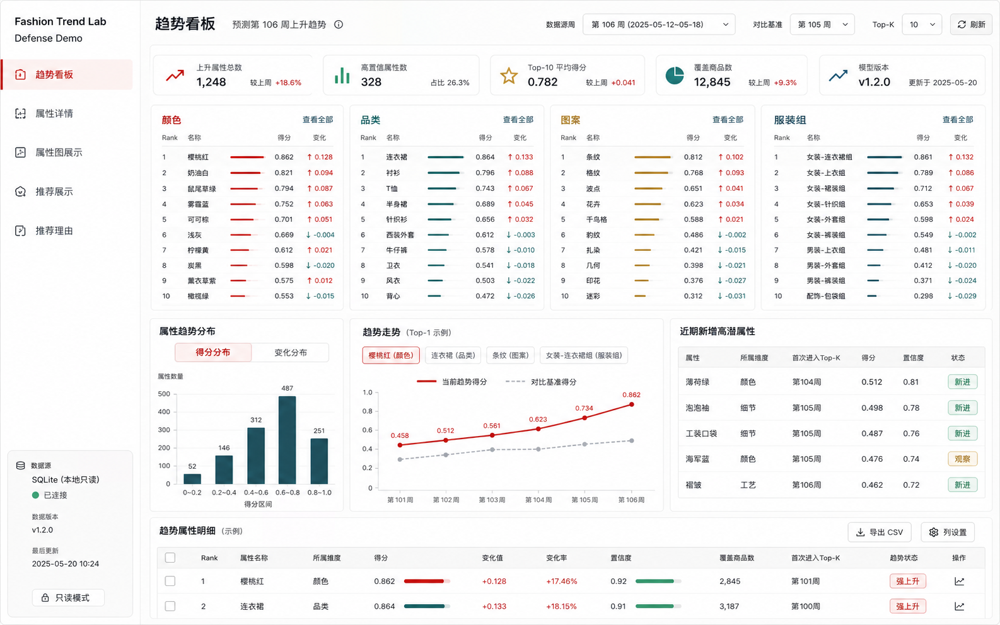
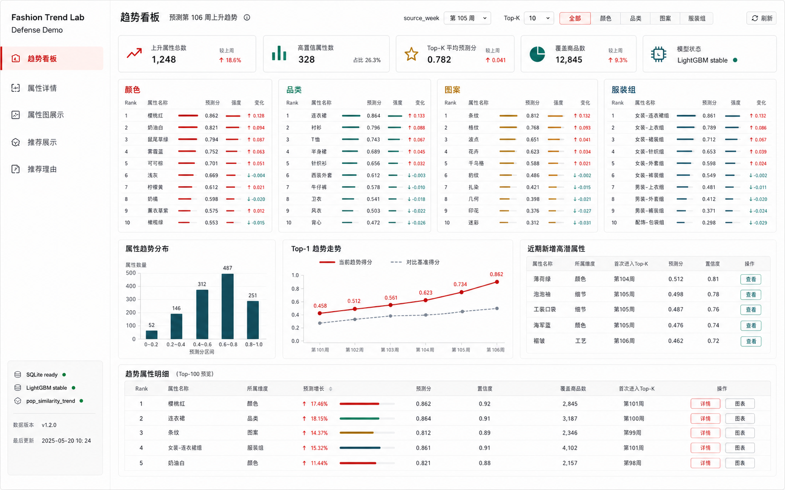
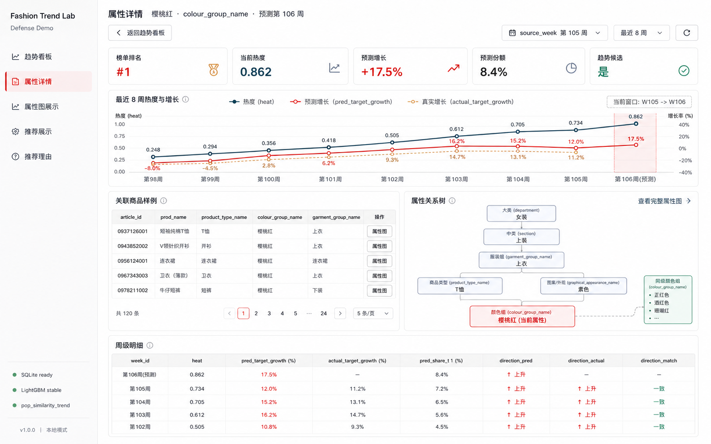
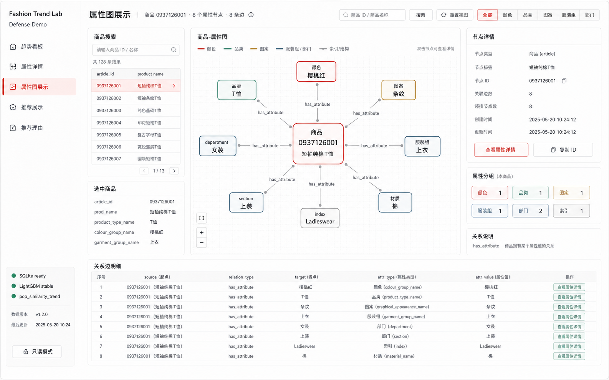
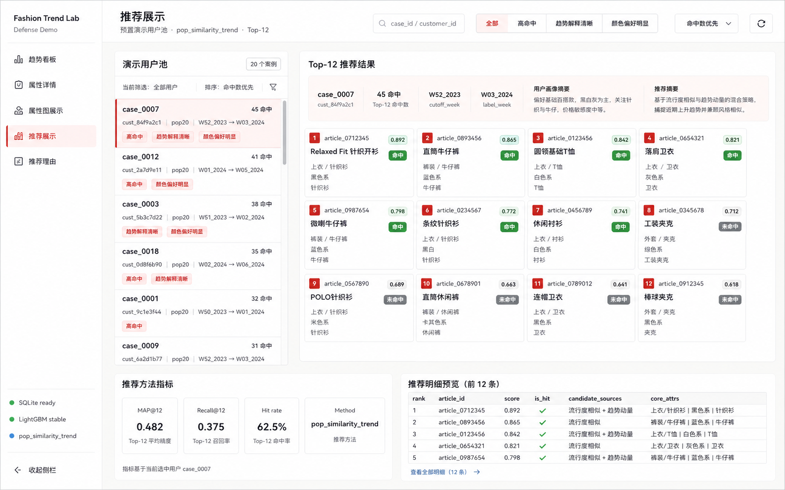
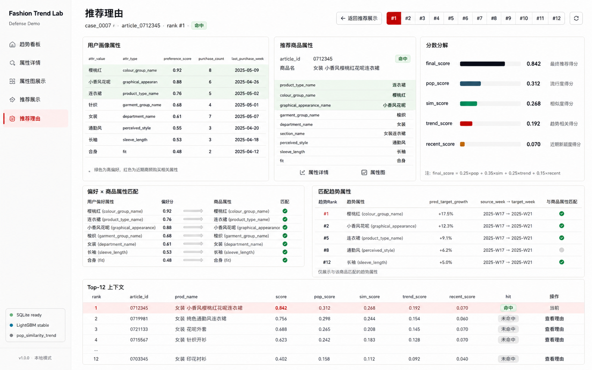

# 答辩展示应用视觉设计契约

## 范围

本文档固化答辩展示应用的全局视觉系统，并从第一个页面“趋势看板”开始定义页面级视觉设计。它补充 `2026-05-12-defense-app-design.md`，只描述界面结构、视觉语言、组件契约和页面呈现方式，不改变既有技术栈、API、SQLite schema 或研究流水线边界。

本应用是本地只读研究展示层：

```text
稳定 artifacts -> SQLite 展示库 -> FastAPI 查询 API -> Vue 答辩展示应用
```

视觉设计不得暗示在线推荐服务、生产推荐平台、实时训练、实时调参或后台管理系统。

## 参考图

全局系统参考图：



参考图用于确认布局、密度、色彩层级和组件语气。图中的部分数据值、日期和示例文案仅作视觉占位，不作为最终业务 copy 或数据契约。

## 设计基准

应用只面向桌面答辩展示：

- 主设计视口：`1440 x 900`。
- 最小建议宽度：`1280px`。
- 不设计移动端导航、汉堡菜单或移动端重排。
- 页面切换时 shell 尺寸保持稳定，减少投影演示中的视觉跳动。
- 视觉目标是正式、研究型、可解释、可操作，而不是营销页、后台管理系统或炫技 dashboard。

## 全局 App Shell

采用固定桌面布局：

```text
┌────────────────────────────────────────────────────────────┐
│ 顶部页面工具栏：页面标题、上下文、筛选控件、数据状态             │
├──────────────┬─────────────────────────────────────────────┤
│ 左侧导航栏    │ 主内容工作区                                  │
│ 220px        │ 图表、榜单、表格、图画布、推荐卡片               │
└──────────────┴─────────────────────────────────────────────┘
```

### 左侧导航栏

左侧导航表达答辩演示路径，而不是普通后台菜单。

导航项顺序固定：

1. 趋势看板
2. 属性详情
3. 属性图展示
4. 推荐展示
5. 推荐理由

导航栏视觉规则：

- 宽度：`220px`。
- 顶部品牌：`Fashion Trend Lab`。
- 品牌副标题：`Defense Demo`。
- 导航项使用 `lucide-vue-next` 线性图标，图标尺寸 `18px`。
- 导航项高度 `42px`，圆角 `6px`。
- 激活态使用左侧 `3px` 趋势红强调线、浅红背景和深红文字。
- hover 态只使用浅灰背景，不使用大色块。
- 底部展示只读系统状态，例如 `SQLite ready`、`LightGBM stable`、`pop_similarity_trend`。这些状态用于说明演示数据来源，不作为营销指标。

### 顶部页面工具栏

顶部工具栏固定高度 `64px`，承载当前页面上下文和当前页操作。

左侧内容：

- 当前页面标题。
- 当前上下文短句，例如 `预测第 106 周上升趋势`、`用户 demo_test_...`、`商品 0706016001`。

右侧内容：

- 当前页筛选控件。
- `source_week`、`Top-K`、用户搜索、标签筛选等页面级操作。
- 数据状态或刷新按钮。

顶部栏不提供全局搜索。搜索属于具体页面，例如商品属性图页搜索商品、推荐页搜索演示用户。

## 视觉系统

### 色彩

基础色：

| Token | 用途 | 色值 |
| --- | --- | --- |
| `--app-bg` | 页面工作区背景 | `#F6F7F5` |
| `--surface` | 主面板 | `#FFFFFF` |
| `--surface-muted` | 次级面板、弱背景 | `#EEF1ED` |
| `--text` | 主文字 | `#1B1D1F` |
| `--muted` | 弱文字 | `#66706A` |
| `--line` | 边框、分割线 | `#D8DED7` |
| `--trend-red` | 趋势上升、当前选中、关键强调 | `#B42318` |
| `--trend-red-soft` | 选中背景、浅强调 | `#FCE9E6` |
| `--signal-green` | 有效信号、命中、就绪状态 | `#0F766E` |
| `--rank-gold` | 排名辅助、观察状态 | `#9A6700` |
| `--graph-blue` | 属性图节点辅助 | `#3A5A6A` |

约束：

- 不使用大面积红色主题。红色只用于上升趋势、命中强调、当前选中和关键变化值。
- 绿色用于有效信号、稳定状态和命中，不和趋势红争夺主视觉。
- 蓝灰用于属性图、关系节点或次级分析，不把系统做成蓝紫科技风。
- 背景保持浅灰白，不使用米色、棕色、紫蓝渐变、玻璃拟态或发光装饰。

### 字体

字体栈：

```css
Inter, "PingFang SC", "Microsoft YaHei", system-ui, sans-serif
```

字号层级：

| 用途 | 字号 | 字重 | 行高 |
| --- | --- | --- | --- |
| 页面标题 | `24px` 到 `28px` | `700` | `1.15` |
| 工具栏标题 | `20px` 到 `22px` | `700` | `1.2` |
| 区块标题 | `15px` 到 `16px` | `700` | `1.25` |
| 表格、榜单、卡片正文 | `13px` | `500` 到 `650` | `1.35` |
| 辅助说明、标签 | `11px` 到 `12px` | `650` 到 `750` | `1.25` |
| 数值指标 | `22px` 到 `28px` | `750` 到 `800` | `1` |

约束：

- `letter-spacing` 保持 `0`。
- 控件文字显式定义字号和字重，不依赖浏览器默认样式。
- 中文和英文混排时优先保证数字、排名和指标值可扫读。

### 空间、边框和圆角

- 主内容区 padding：`24px`。
- 页面内部模块间距：`16px` 到 `20px`。
- 面板内部 padding：`14px` 到 `16px`。
- 常规面板圆角：`8px`。
- 输入框、按钮、导航项圆角：`6px`。
- 状态标签可使用 `999px` 圆角，但只用于小型 chip，不泛滥成装饰。
- 主要使用细边框表达层级，阴影仅用于轻微浮层，不用于普通面板。

## 共享组件契约

### `AppShell`

负责左侧导航、顶部页面工具栏和主工作区布局。它不承载页面业务逻辑。

### `PageToolbar`

每页工具栏由页面传入：

- `title`
- `context`
- `actions`
- `status`

工具栏右侧控件必须与当前页任务直接相关。

### `Panel`

用于明确的信息单元，例如榜单、图表、表格、详情摘要。禁止卡片套卡片。

### `MetricTile`

用于少量关键指标。每个 tile 包含：

- 图标或小型状态符号。
- 指标名称。
- 主数值。
- 可选变化说明。

指标 tile 不应超过第一屏可读负担。趋势看板第一版建议 4 到 5 个。

### `TrendRankList`

用于趋势榜单。每行固定包含：

- rank。
- 属性名。
- 属性类型或 attr_id 的弱信息。
- 预测分或预测增长。
- 小型横向强度条。

点击行进入属性详情。

### `DataTable`

用于商品、属性、用户画像和趋势明细。表格应保持密集但不拥挤，行高建议 `42px` 到 `48px`。

### `GraphCanvas`

用于属性图展示。它是工作画布，不是普通卡片。画布应有清晰边界、浅网格或弱背景，并保证节点标签可读。

### `RecommendationCard`

用于 Top-12 推荐。每张卡片必须突出：

- rank。
- 商品名或 article_id。
- score。
- hit/miss。
- 核心属性摘要。

### `ScoreBars`

用于解释 `pop_score`、`sim_score`、`trend_score`、`recent_score` 和 `final_score`。条形长度必须可比较，不能只是装饰。

### 状态组件

统一状态：

- loading：保留布局骨架，不整页闪烁。
- empty：短句说明当前没有数据。
- error：红色边框、浅红背景和明确错误信息。
- selected：浅红背景、深红边框或左侧强调线。
- hit：绿色 chip。
- miss：灰色 chip。

## 趋势看板页面设计

### 页面视觉参考

趋势看板页面参考图：



参考图用于固定趋势看板的页面密度、首屏布局、四列趋势榜、证据区和明细表的视觉比例。图中的具体数值、日期、属性名和模型版本是示例数据，不作为业务事实或 API 契约。

### 页面目标

趋势看板是答辩展示应用的入口页，回答一个问题：

> 下一周哪些颜色、品类、图案和服装组正在上升？

页面应让观众在 10 秒内理解：

- 当前预测窗口是哪一周。
- 模型输出了哪些核心趋势属性。
- 每类属性的 Top-K 排名。
- 趋势信号是否来自稳定 LightGBM 预测和已发布 artifact。
- 点击某个属性后可以继续进入属性详情解释。

### 页面结构

趋势看板使用全局 shell 后，主工作区分为四段：

```text
PageToolbar
  标题：趋势看板
  上下文：预测第 target_week 周上升趋势
  控件：source_week、Top-K、属性类型筛选、刷新

MetricStrip
  核心指标 4 到 5 个

TrendRankMatrix
  四列趋势榜：颜色、品类、图案、服装组

EvidenceArea
  分布图、Top-1 走势、近期新增高潜属性、趋势明细表
```

首屏布局比例：

- 顶部工具栏固定 `64px`。
- 指标条占一行，高度约 `76px`。
- 四列趋势榜是首屏主视觉，高度约 `280px` 到 `320px`。
- 证据区在四列榜单下方，采用 `3` 个横向模块：左侧分布图、中间走势折线图、右侧新增高潜属性表。
- 页面底部保留趋势明细表预览，作为深挖入口，不抢占四列榜单的主视觉。

### 顶部工具栏

左侧：

- 主标题：`趋势看板`
- 上下文：`预测第 {target_week} 周上升趋势`

右侧：

- `source_week` 下拉或输入。
- `Top-K` select，第一版选项 `5 / 10 / 20 / 50`。
- 属性类型筛选，默认全部。
- 刷新按钮。

控件应紧凑排列，不占用页面主视觉。

顶部工具栏的视觉优先级是“标题和预测窗口先读，筛选控件后读”。控件应保持同一高度，使用细边框、白底和紧凑字号；刷新按钮只使用图标加短文本或纯图标，不做高亮主按钮。

### 核心指标条

指标条用于提供全局可信度和数据上下文。建议第一版展示：

1. 上升属性总数。
2. 高置信属性数。
3. Top-K 平均预测分。
4. 覆盖商品数。
5. 模型版本或 stable artifact 状态。

指标 tile 视觉规则：

- 白色面板，细边框，`8px` 圆角。
- 左侧小图标使用红、绿、金、蓝灰之一。
- 主数值大号显示。
- 变化值或说明放在右下或副文本。
- 指标条只提供上下文，不承载主要结论；主要结论仍由四列趋势榜表达。

### 四列趋势榜

四列固定顺序：

1. 颜色
2. 品类
3. 图案
4. 服装组

每列是一个 `TrendRankList` 面板。

每行展示：

- `Rank`
- 属性名称
- 预测 score 或 `pred_target_growth`
- 小型强度条
- 变化方向

交互：

- 点击行进入 `/attributes/:attrId`。
- hover 时只改变背景和边框，不放大、不移动布局。
- 当前筛选某一属性类型时，矩阵变成单列或宽表视图；默认答辩演示使用四列总览。

视觉重点：

- `rank` 和属性名必须最容易扫读。
- 趋势红只标记上升变化值和当前选中。
- `pred_target_growth` 缺失时显示 `--`，不得用假数据或 fallback 成 0。
- 每列标题使用对应维度的轻量强调色：颜色用趋势红，品类用绿色，图案用金色，服装组用蓝灰。强调色只用于标题、强度条或少量变化标记，不染色整个面板。
- 四列之间保持相同列宽、相同行高和相同字段顺序，方便答辩时横向比较。
- 榜单行应避免过度卡片化；使用轻量分隔线和 hover 背景即可。

### 下方证据区

趋势看板第一版下方证据区包含三个模块：

1. **属性趋势分布**
   - 柱状图或直方图。
   - 说明预测分或增长值在属性集合中的分布。

2. **趋势走势**
   - 折线图。
   - 默认展示每类榜单 Top-1 的最近周变化。
   - 允许切换选中的属性，但第一版不做复杂多选。

3. **近期新增高潜属性**
   - 紧凑表格。
   - 展示首次进入 Top-K 的属性、所属维度、得分、置信度和状态。

下方还可以保留一个完整趋势明细表，但它不应抢占首屏主视觉。

证据区视觉规则：

- 分布图用于解释整体预测分或增长值分布，适合使用柱状图。
- 走势折线图应占据中间更宽区域，用于讲清 Top-1 属性近期变化；默认显示当前趋势分和对比基准分两条线。
- 新增高潜属性表格用于展示“首次进入 Top-K”的补充发现，状态列使用小型 chip，例如 `新进`、`观察`。
- 趋势明细表行高保持紧凑，操作列只提供 `详情` 和必要的图入口，不放训练、重跑或推荐计算操作。

### 页面交互

趋势看板的交互保持演示友好：

- 修改 `source_week` 后刷新四列榜单、指标条和证据区。
- 修改 `Top-K` 后只改变榜单和相关汇总，不改变页面结构。
- 属性类型筛选默认 `全部`；筛选单一类型时可以只突出对应面板，其他面板降权或隐藏。第一版推荐保持四列布局，避免答辩时页面突然大幅跳动。
- 点击趋势榜行或明细表 `详情` 进入属性详情页，并保留 `source_week` 上下文。
- 点击明细表图入口可以进入属性图或属性详情中的关系区，具体跳转以实现阶段的信息架构为准。

### 实现切分建议

趋势看板实现时建议按以下组件切分：

- `TrendDashboardView`：页面级状态、API 调用和 query 同步。
- `PageToolbar`：标题、上下文和筛选控件。
- `TrendMetricStrip`：指标条。
- `TrendRankMatrix`：四列布局容器。
- `TrendRankList`：单个属性类型榜单。
- `TrendEvidenceArea`：分布图、走势折线图和新增高潜属性表。
- `TrendDetailTable`：趋势属性明细表。

页面级 API 错误不应让整个应用白屏。每个数据区应有自己的 loading、empty 和 error 状态。

### 空状态和错误状态

- 若某个属性类型没有结果，只在该列显示空状态，不影响其他列。
- 若 metrics 加载失败，指标条显示局部错误，不阻塞趋势榜。
- 若趋势榜整体加载失败，主工作区显示可定位错误信息。
- 若 `source_week` 非法，由 API 返回 validation error，前端展示明确错误，不静默回退。

### 页面不做的内容

趋势看板不做：

- 模型训练按钮。
- 推荐结果入口之外的推荐计算操作。
- 全量交易查询。
- 复杂图数据库视图。
- 大面积商品图片。
- 营销式 hero。
- 移动端布局。

## 属性详情页面设计

### 页面视觉参考

属性详情页面参考图：



参考图用于固定属性详情页的页面密度、曲线图主视觉、关联商品表、属性关系树和周级明细的视觉比例。图中的具体属性名、article_id、数值和版本号是示例数据，不作为业务事实或 API 契约。

### 页面目标

属性详情页承接趋势看板中的属性点击，回答一个问题：

> 这个属性为什么被认为是下一周趋势属性？

页面应让观众快速理解：

- 当前属性属于哪个维度。
- 它在趋势榜中的排名、当前热度、预测增长和预测份额。
- 最近 8 周 heat 与增长趋势是否支持该预测。
- 它在商品属性结构中处于什么位置。
- 它连接了哪些代表商品，并可继续进入属性图展示页。

### 页面结构

属性详情页使用全局 shell 后，主工作区分为五段：

```text
PageToolbar
  标题：属性详情
  上下文：attr_value · attr_type · 预测第 target_week 周
  控件：返回趋势看板、source_week、最近周数、刷新

AttributeSummaryBand
  rank、当前热度、预测增长、预测份额、趋势候选

AttributeHeatEvidence
  最近 8 周热度与增长曲线

RelatedEvidence
  左侧：关联商品样例
  右侧：属性关系树

WeekDetailTable
  周级明细
```

首屏布局比例：

- 顶部工具栏固定 `64px`。
- 摘要指标条占一行，高度约 `76px`。
- 最近 8 周曲线图是页面主视觉，高度约 `220px` 到 `260px`，宽度尽量横向铺开。
- 关联商品样例与属性关系树左右并排，比例约 `1:1`。
- 周级明细表位于页面底部，作为追问时的证据补充。

### 顶部工具栏

左侧：

- 主标题：`属性详情`
- 上下文：`{attr_value} · {attr_type} · 预测第 {target_week} 周`
- 返回按钮：`返回趋势看板`

右侧：

- `source_week` 下拉或输入。
- 最近周数选择，第一版默认 `最近 8 周`，上限仍以 API 的 `weeks` 参数为准。
- 刷新按钮。

返回趋势看板时应保留 `source_week` 和必要筛选上下文，避免答辩演示中丢失当前窗口。

### 属性摘要指标条

摘要指标条用于表达当前属性的结论，不重复绘制复杂解释面板。第一版展示：

1. 榜单排名。
2. 当前热度。
3. 预测增长。
4. 预测份额。
5. 趋势候选状态。

视觉规则：

- `rank` 使用大号红色或金色数字。
- `预测增长` 使用 signed percent，正值使用趋势红。
- `趋势候选` 使用绿色状态 chip 或绿色图标。
- 缺失值显示 `--`，不得补 0 或假数据。

### 最近 8 周热度与增长

曲线图是属性详情页的主证据。

图表字段：

- `heat`：热度主线，使用蓝灰或绿色实线。
- `pred_target_growth`：预测增长，使用趋势红线或红色点。
- `actual_target_growth`：真实增长，若可用则使用灰色虚线或弱金色线；若缺失则显示 `--` 或不绘制该点。
- `pred_share_t1`：不作为主线，可放在 tooltip 或周级明细表中。

图表视觉规则：

- 使用 ECharts 风格的简洁坐标轴和轻网格线。
- 当前预测窗口用轻量竖向高亮区标记，例如 `W105 -> W106`。
- legend 保持紧凑，放在图表顶部。
- 不再设置独立的“预测证据”面板。预测方向、真实方向和一致性应由曲线图与周级明细共同表达。

### 关联商品样例

关联商品区域展示带有该属性的代表商品。第一版使用紧凑表格，不使用商品图片墙。

建议列：

- `article_id`
- `prod_name`
- `product_type_name`
- `colour_group_name`
- `garment_group_name`
- 操作：`属性图`

交互：

- 点击 `属性图` 进入 `/graph/articles/:articleId`。
- 表格只展示样例，不做全量商品搜索。
- 若无关联商品，显示局部空状态，不影响曲线图和属性关系树。

### 属性关系树

属性关系使用轻量树状图展示，不使用纯关系列表，也不在此页承载完整属性图画布。

树状图目标：

- 说明当前属性在商品属性层级中的位置。
- 展示父级、同级或子级关系。
- 为下一页“属性图展示”提供自然入口。

建议结构：

```text
department / section
  -> garment_group_name
    -> product_type_name
      -> 当前属性
      -> 同级或相关属性
```

实际数据可能缺少某些层级，树状图应从可用节点开始绘制，不能为了完整树而造假节点。

视觉规则：

- 当前属性节点使用浅红背景和趋势红边框。
- 父级节点使用蓝灰弱强调。
- 子级或同级节点使用绿色或浅灰弱强调。
- 连线使用浅灰色，保持细线，不使用复杂箭头。
- 节点使用小型圆角矩形，文字必须可读。
- 面板右上角提供 `查看完整属性图` 入口，跳转到属性图展示页。

### 周级明细表

周级明细表用于答辩追问时解释每周数值。

建议列：

- `week_id`
- `heat`
- `pred_target_growth`
- `actual_target_growth`
- `pred_share_t1`
- `direction_pred`
- `direction_actual`
- `direction_match`

视觉规则：

- 行高保持紧凑。
- 当前预测周或目标周可使用浅红背景弱高亮。
- `direction_match` 为一致时使用绿色；缺失真实值时显示 `--`。

### 页面交互

- 从趋势看板进入时保留 `source_week` query。
- 切换 `source_week` 或最近周数后刷新摘要、曲线、关联商品、属性关系树和周级明细。
- 曲线 hover 显示 `week_id`、`heat`、`pred_target_growth`、`actual_target_growth` 和 `pred_share_t1`。
- 点击关联商品的 `属性图` 进入商品属性图页。
- 点击属性关系树节点进入对应属性详情页。
- 点击 `查看完整属性图` 进入属性图展示页，并尽量携带当前属性或代表商品上下文。

### 实现切分建议

属性详情页实现时建议按以下组件切分：

- `AttributeDetailView`：页面级状态、API 调用和 query 同步。
- `AttributeSummaryBand`：摘要指标条。
- `AttributeHeatChart`：最近 8 周热度与增长图。
- `RelatedArticleTable`：关联商品样例。
- `AttributeRelationTree`：属性关系树。
- `AttributeWeekDetailTable`：周级明细表。

每个区域应有自己的 loading、empty 和 error 状态。辅助数据加载失败时，保留已成功加载的属性基础信息和曲线图，不应整页失败。

### 页面不做的内容

属性详情页不做：

- 单独的“预测证据”面板。
- 模型训练、重跑预测或调参按钮。
- 全量商品搜索。
- 大面积商品图片墙。
- 完整商品-属性图画布。
- 推荐解释内容。
- 移动端布局。

## 属性图展示页面设计

### 页面视觉参考

属性图展示页面参考图：



参考图用于固定属性图展示页的三栏工作区、中央商品-属性图画布、节点详情、属性分组和关系边明细的视觉比例。图中的具体商品名、article_id、时间和属性值是示例数据，不作为业务事实或 API 契约。

### 页面目标

属性图展示页承接属性详情中的关联商品和 `查看完整属性图` 入口，回答一个问题：

> 一个商品如何连接到颜色、品类、图案、服装组、部门等属性？

页面应让观众快速理解：

- 商品节点是图的中心。
- 商品与颜色、品类、图案、服装组、部门、section、index 等属性通过边连接。
- 属性图是推荐解释和趋势解释可以回溯的结构证据。
- 图可以被关系边明细表审计，不只是装饰性图形。

本页是只读图展示工作区，不是 Neo4j 浏览器、图数据库编辑器或全量商品图谱系统。

### 页面结构

属性图展示页使用全局 shell 后，主工作区分为三段：

```text
PageToolbar
  标题：属性图展示
  上下文：当前商品、节点数、边数
  控件：商品搜索、重置视图、节点类型筛选

GraphWorkspace
  左侧：商品搜索与选中商品摘要
  中央：商品-属性图画布
  右侧：节点详情、属性分组、关系说明

GraphEdgeTable
  关系边明细
```

工作区布局：

- 左侧栏宽度约 `280px`，承载搜索结果和选中商品摘要。
- 中央画布占据主要宽度，是页面主视觉。
- 右侧栏宽度约 `280px`，承载选中节点解释和属性分组。
- 底部关系边明细表横跨主内容宽度。

### 顶部工具栏

左侧：

- 主标题：`属性图展示`
- 上下文：`商品 {article_id} · {node_count} 个属性节点 · {edge_count} 条边`

右侧：

- 商品搜索输入框，placeholder 为 `商品 ID / 商品名称`。
- `搜索` 按钮。
- `重置视图` 按钮。
- 节点类型筛选：`全部 / 颜色 / 品类 / 图案 / 服装组 / 部门`。

搜索只属于本页，不上升为全局搜索。筛选只影响画布节点高亮或显示，不触发上游数据重算。

### 左侧商品搜索与摘要

左侧栏包含两个面板。

商品搜索结果：

- 展示 `article_id`、商品名、商品类型或颜色摘要。
- 选中行使用浅红背景和趋势红边框。
- 搜索结果为空时只在该面板显示空状态。

选中商品摘要：

- `article_id`
- `prod_name`
- `product_type_name`
- `colour_group_name`
- `garment_group_name`

本页第一版不展示商品图片。无图片资源时不保留图片占位。

### 商品-属性图画布

中央画布是本页主视觉。第一版使用轻量自定义 SVG 或等价 code-native 图布局，不引入图数据库浏览器式交互。

图结构：

- 中心节点：当前商品。
- 周围节点：商品属性节点。
- 边：商品到属性的 `has_attribute` 或后端返回的 `relation_type`。

节点建议覆盖：

- 颜色：`colour_group_name`
- 品类：`product_type_name`
- 图案：`graphical_appearance_name`
- 服装组：`garment_group_name`
- 部门：`department_name`
- section、index、index_group 或其他可用属性

视觉规则：

- 画布使用白色背景、细边框和极浅网格，表达工作区。
- 商品节点居中，使用趋势红边框或深色主节点。
- 属性节点使用小型圆角矩形，文字必须可读。
- 颜色节点使用趋势红弱强调。
- 品类节点使用绿色弱强调。
- 图案节点使用金色弱强调。
- 服装组、部门和 section 节点使用蓝灰弱强调。
- 边线使用浅灰，hover 或选中时加深。
- 关系标签保持短文本，例如 `has_attribute`。
- 不使用力导向随机布局；节点位置应稳定，便于答辩演示复现。

画布交互：

- 点击节点后更新右侧节点详情。
- hover 节点时高亮相连边。
- 点击属性节点可进入 `/attributes/:attrId`。
- `重置视图` 恢复默认缩放和平移。
- 第一版不要求拖拽保存节点位置。

### 右侧节点详情与属性分组

右侧栏包含三个面板。

节点详情：

- 节点类型。
- 节点标签。
- 节点 ID。
- 关联边数。
- 相邻节点数。
- 操作：`查看属性详情` 或 `复制 ID`。

参考图中出现的创建时间、更新时间不是第一版 schema 必需字段，不应写成实现要求；如 API 没有这些字段，页面不显示。

属性分组：

- 展示当前商品各属性类型数量，例如 `颜色 1`、`品类 1`、`图案 1`、`服装组 1`、`部门 2`。
- 使用小型 chip 或紧凑统计块。
- 分组点击可用于筛选或高亮对应节点类型。

关系说明：

- 用一行短文解释主要关系，例如 `has_attribute 表示商品拥有某个属性值`。
- 不写长段说明，避免挤占图画布空间。

### 关系边明细表

底部关系边明细表用于审计图数据。

建议列：

- `source`
- `relation_type`
- `target`
- `attr_type`
- `attr_value`
- 操作：`查看属性详情`

视觉规则：

- 表格行高保持紧凑。
- `relation_type` 使用等宽或弱强调文本。
- 操作列只能跳转查看，不提供编辑、删除或管理动作。

### 页面状态

- 初始状态：中央画布提示 `搜索或选择一个商品查看属性图`。
- 无搜索结果：左侧搜索结果面板显示空状态。
- 商品无属性边：中央画布显示空状态，右侧节点详情清空。
- 图加载失败：中央画布显示错误，左侧搜索仍可用。
- 节点详情字段缺失：显示 `--`，不得编造说明。

### 实现切分建议

属性图展示页实现时建议按以下组件切分：

- `AttributeGraphView`：页面级状态、API 调用和 query 同步。
- `ArticleSearchPanel`：商品搜索与结果列表。
- `SelectedArticleSummary`：选中商品摘要。
- `ArticleAttributeGraphCanvas`：商品-属性图画布。
- `GraphNodeInspector`：节点详情。
- `AttributeGroupSummary`：属性分组统计。
- `GraphEdgeTable`：关系边明细表。

### 页面不做的内容

属性图展示页不做：

- Neo4j 风格全量图浏览器。
- 全量商品图谱加载。
- 图编辑、节点增删、边增删或拖拽保存。
- 自动推荐计算。
- 复杂力导向动画。
- 商品图片墙。
- 移动端布局。

## 推荐展示页面设计

### 页面视觉参考

推荐展示页面参考图：



参考图用于固定推荐展示页的两栏工作区、演示用户池、Top-12 推荐卡片网格、推荐方法指标和推荐明细预览的视觉比例。图中的 case_id、customer_id、周窗口、命中数、指标值和商品信息是示例数据，不作为业务事实或 API 契约。

### 页面目标

推荐展示页是推荐链路的入口页，回答一个问题：

> 对一个预置演示用户，系统推荐了哪些 Top-12 商品？

页面应让观众快速理解：

- 应用使用预置高质量演示用户池，而不是任意实时用户推荐。
- 当前选择了哪个 `case_id`。
- 该用户的 Top-12 推荐商品是什么。
- 推荐结果中哪些命中，哪些未命中。
- 推荐方法和核心指标是什么。

详细推荐理由、用户画像和分数分解不在本页展开，留给下一页“推荐理由与用户画像”。

### 页面结构

推荐展示页使用全局 shell 后，主工作区分为三段：

```text
PageToolbar
  标题：推荐展示
  上下文：预置演示用户池、method、Top-12
  控件：用户搜索、标签筛选、排序、刷新

RecommendationWorkspace
  左侧：演示用户池
  右侧：选中用户摘要 + Top-12 推荐卡片

RecommendationEvidence
  推荐方法指标 + 推荐明细预览
```

工作区布局：

- 左侧演示用户池宽度约 `340px`。
- 右侧 Top-12 推荐区域占据主要宽度，是页面主视觉。
- 底部证据区分为推荐方法指标和推荐明细预览两个模块。

### 顶部工具栏

左侧：

- 主标题：`推荐展示`
- 上下文：`预置演示用户池 · {method} · Top-12`

右侧：

- 用户搜索输入框，placeholder 为 `case_id / customer_id`。
- 标签筛选：`全部 / 高命中 / 趋势解释清晰 / 颜色偏好明显`。
- 排序选择：`命中数优先 / case_id`。
- 刷新按钮。

顶部控件应表达“筛选预置演示用户池”，不得暗示任意用户实时推荐生成。

### 演示用户池

左侧用户池是选择器，不是用户画像详情页。

用户列表每行展示：

- `case_id`
- `customer_id` 的短显示形式。
- `split`
- `cutoff_week -> label_week`
- `hit_count`
- `primary_tags` 中的 2 到 3 个标签。

视觉规则：

- 选中用户使用浅红背景和趋势红左侧线。
- 标签使用浅灰、浅红或浅绿弱强调，不全部使用红色。
- 列表保持可扫读，行内不放长段 profile 文案。
- 列表顶部展示案例数量、当前筛选和排序方式。

无匹配演示用户时，只在左侧用户池显示空状态，右侧显示未选中提示。

### 选中用户摘要

Top-12 网格上方展示紧凑摘要条，用于说明当前推荐上下文。

建议字段：

- `case_id`
- `customer_id` 短 ID。
- `hit_count`
- `cutoff_week`
- `label_week`
- `profile_summary`
- `recommendation_summary`

摘要条文案必须短。完整用户画像和推荐理由留给下一页。

### Top-12 推荐结果

Top-12 推荐结果是本页主视觉。桌面答辩场景下建议使用 `4 x 3` 卡片网格。

每张推荐卡片展示：

- rank。
- `article_id`。
- 商品名或商品类型。
- score chip。
- hit / miss chip。
- 核心属性摘要：
  - `product_type_name`
  - `colour_group_name`
  - `garment_group_name`
- `candidate_sources` 或简短 method signal。

视觉规则：

- rank 最醒目，但不遮挡商品信息。
- hit 使用绿色 chip，miss 使用灰色 chip。
- score 使用小型 chip，不抢过 rank 和商品名。
- 卡片不使用商品图片。
- 卡片 hover 只改变边框或浅背景，不改变尺寸。

交互：

- 点击卡片进入 `/recommendations/:caseId/:articleId`。
- 若 Top-12 数量不足，显示局部 warning，提示展示库契约异常。
- 若同一用户窗口出现重复 `article_id`，显示局部错误，不静默去重。

### 推荐方法指标

底部左侧展示推荐方法指标。建议第一版展示：

- MAP@12。
- Recall@12。
- Hit rate。
- Method。

指标值以 `metrics_summary` 或推荐 metrics artifact 为准。参考图中的数值只是视觉示例。

### 推荐明细预览

底部右侧展示推荐明细表预览。

建议列：

- `rank`
- `article_id`
- `score`
- `is_hit`
- `candidate_sources`
- `core_attrs`

明细表只作为审计预览，不替代 Top-12 卡片主视觉。若空间不足，默认显示前 5 行并提供进入完整推荐理由页的入口。

### 页面状态

- 无演示用户：左侧显示空状态，右侧显示 `暂无选中用户`。
- 用户列表加载失败：左侧显示错误，右侧不崩溃。
- 推荐列表加载失败：右侧显示错误，左侧仍可切换用户。
- Top-12 不完整：右侧显示 warning。
- 重复推荐商品：右侧显示局部错误。

### 实现切分建议

推荐展示页实现时建议按以下组件切分：

- `RecommendationView`：页面级状态、API 调用和 query 同步。
- `DemoUserFilterBar`：搜索、标签和排序控件。
- `DemoUserList`：演示用户列表。
- `SelectedDemoUserSummary`：选中用户摘要条。
- `RecommendationGrid`：Top-12 网格。
- `RecommendationCard`：单个推荐卡片。
- `RecommendationMethodMetrics`：推荐方法指标。
- `RecommendationItemsTable`：推荐明细预览。

### 页面不做的内容

推荐展示页不做：

- 任意用户实时推荐计算。
- 商品详情页。
- 推荐理由深度解释。
- 分数分解图。
- 用户画像大表。
- 模型训练、实验重跑或调参。
- 商品图片墙。
- 在线服务状态暗示。
- 移动端布局。

## 推荐理由与用户画像页面设计

### 页面视觉参考

推荐理由与用户画像页面参考图：



参考图用于固定推荐理由页的三栏解释工作区、偏好与商品属性匹配、趋势属性匹配和 Top-12 上下文的视觉比例。图中的 case_id、article_id、周窗口、分数、公式、属性值和命中状态是示例数据，不作为业务事实或 API 契约。

### 页面目标

推荐理由与用户画像页是推荐演示链路的解释终点，回答一个问题：

> 为什么给这个用户推荐这个商品？

页面应让观众快速理解：

- 当前解释的是哪个 `case_id` 和哪个 `article_id`。
- 用户画像中哪些属性偏好与商品属性匹配。
- 推荐商品有哪些核心属性。
- `pop_score`、`sim_score`、`trend_score`、`recent_score` 如何贡献到 `final_score`。
- 商品属性是否匹配当前趋势属性。
- 当前商品在 Top-12 推荐上下文中的位置。

本页只解释已有推荐结果，不重新计算推荐、不修改权重、不运行 rerank 实验。

### 页面结构

推荐理由页使用全局 shell 后，主工作区分为四段：

```text
PageToolbar
  标题：推荐理由
  上下文：case_id、article_id、rank、hit 状态
  控件：返回推荐展示、Top-12 商品切换、刷新

ReasonWorkspace
  左侧：用户画像属性
  中央：推荐商品属性
  右侧：分数分解

EvidenceChain
  偏好 × 商品属性匹配
  匹配趋势属性

Top12Context
  Top-12 推荐上下文
```

首屏布局比例：

- 顶部工具栏固定 `64px`。
- 三栏解释工作区是首屏主视觉，高度约 `300px` 到 `360px`。
- 偏好匹配和趋势匹配位于第二行，左右并排。
- Top-12 上下文位于底部，作为切换和审计辅助。

### 顶部工具栏

左侧：

- 主标题：`推荐理由`
- 上下文：`{case_id} · {article_id} · rank #{rank} · {命中状态}`

右侧：

- `返回推荐展示` 按钮。
- Top-12 商品切换器：`#1` 到 `#12`。
- 刷新按钮。

Top-12 切换器只切换当前解释商品，不重新生成推荐列表。当前 rank 使用趋势红激活态。

### 用户画像属性

左侧面板展示推荐解释所需的用户偏好属性，不承载完整用户画像系统。

建议列：

- `attr_value`
- `attr_type`
- `preference_score`
- `purchase_count`
- `last_purchase_week`

视觉规则：

- 与当前商品属性匹配的用户偏好使用浅绿或浅红弱高亮。
- 偏好分高的属性可以更靠前，但高亮必须来自真实匹配关系，不固定高亮前几项。
- 空用户画像显示局部空状态，不影响商品属性和分数分解展示。

### 推荐商品属性

中央面板展示当前被解释商品。

建议字段：

- `article_id`
- `prod_name`
- `product_type_name`
- `colour_group_name`
- `graphical_appearance_name`
- `garment_group_name`
- `department_name`
- `section_name`

视觉规则：

- hit / miss 状态放在标题区或商品摘要右侧。
- 与用户画像或趋势属性匹配的商品属性使用弱高亮。
- 属性项提供 `属性详情` 入口。
- 商品摘要提供 `属性图` 入口。
- 不展示商品图片，不进入商品详情页。

### 分数分解

右侧面板是本页主视觉之一，用条形图解释分数组成。

展示项：

- `final_score`
- `pop_score`
- `sim_score`
- `trend_score`
- `recent_score`

视觉规则：

- 每个 score 一行，包含 label、条形、数值和简短含义。
- `final_score` 使用最强视觉权重，但不参与彩色分类。
- `pop_score` 使用蓝灰。
- `sim_score` 使用绿色。
- `trend_score` 使用趋势红。
- `recent_score` 使用金色。
- 条形长度必须可比较，不能只是装饰。

参考图中的 `final_score` 公式仅作视觉示意。真实权重和计算语义必须以推荐 method 的 `params.json`、metadata 或后端 explanation payload 为准；如果没有公式字段，页面不显示公式。

### 偏好 × 商品属性匹配

该区域把用户偏好和商品属性连接起来，回答“这个商品为什么像这个用户的历史偏好”。

建议展示方式：

- 左列：用户偏好属性。
- 中列：匹配方向或连接符。
- 右列：商品属性。
- 末列：匹配状态。

匹配行示例：

```text
用户偏好：樱桃红 -> 商品属性：樱桃红 -> 匹配
```

视觉规则：

- 使用紧凑行或 paired chips，不使用大型装饰流程图。
- 匹配成功使用绿色状态。
- 未匹配但可解释的属性可使用灰色状态。
- 只展示与当前商品有关的匹配，不做完整画像展开。

### 匹配趋势属性

该区域回答“这个推荐是否利用了当前趋势信号”。

建议列：

- `rank`
- `attr_value`
- `attr_type`
- `pred_target_growth`
- `source_week -> target_week`
- 是否与商品属性匹配

视觉规则：

- 趋势 rank 使用趋势红或金色弱强调。
- 与商品属性匹配的趋势属性使用绿色状态。
- 无匹配趋势属性时显示 `暂无匹配趋势属性`，不得硬凑趋势解释。
- 点击趋势属性进入属性详情页。

### Top-12 上下文

底部展示当前用户的 Top-12 推荐上下文，帮助观众理解当前商品在列表中的位置。

建议列：

- `rank`
- `article_id`
- `prod_name`
- `score`
- `pop_score`
- `sim_score`
- `trend_score`
- `recent_score`
- `hit`
- 操作

视觉规则：

- 当前解释商品行使用浅红背景高亮。
- 点击其他行切换当前解释商品。
- 表格只展示上下文，不重复完整推荐展示页的卡片网格。

### 页面状态

- 没有 `articleId`：显示 Top-12 上下文，并提示选择一个商品查看解释。
- explanation payload 缺少 score component：分数分解区域显示局部缺失状态。
- 无匹配趋势属性：趋势匹配区域显示空状态。
- 用户画像为空：用户画像区域显示空状态，商品和分数区域继续展示。
- 商品属性为空：商品属性区域显示空状态。
- Top-12 上下文加载失败：底部区域显示错误，不影响上方 explanation 展示。

### 实现切分建议

推荐理由页实现时建议按以下组件切分：

- `UserProfileReasonView`：页面级状态、API 调用和 route params 同步。
- `ReasonPageToolbar`：返回、Top-12 切换和刷新。
- `UserProfileAttributePanel`：用户画像属性。
- `RecommendationArticlePanel`：推荐商品属性。
- `ScoreBreakdownPanel`：分数分解。
- `PreferenceAttributeMatchPanel`：偏好与商品属性匹配。
- `TrendMatchPanel`：趋势属性匹配。
- `Top12ContextList`：Top-12 上下文。

### 页面不做的内容

推荐理由页不做：

- 重新计算推荐。
- 修改权重。
- rerank 实验。
- 完整用户画像系统。
- 在线个性化解释。
- 大段自然语言生成解释。
- 商品详情页。
- 商品图片墙。
- 移动端布局。

## 后续页面设计衔接

趋势看板点击属性后进入属性详情。视觉上应保持：

- 同一左侧导航和顶部工具栏。
- 属性名称在属性详情页成为页面标题。
- 趋势看板的 rank、score、growth 在属性详情页继续作为解释上下文。
- 属性详情页中的 `属性图` 或 `查看完整属性图` 入口进入属性图展示页，并携带当前商品或属性上下文。
- 属性图展示页点击属性节点后可回到属性详情页，形成属性证据与结构证据之间的闭环。
- 推荐展示页点击 Top-12 推荐卡片后进入推荐理由页，并携带 `case_id` 与 `article_id`。
- 推荐展示页只负责选择演示用户和展示 Top-12，推荐解释链路在下一页完成。
- 推荐理由页的属性入口回到属性详情页，商品入口进入属性图展示页，形成推荐解释到趋势证据和属性结构证据的闭环。

后续页面应继续复用本文档的 token、面板、表格、状态、图表和导航契约。
